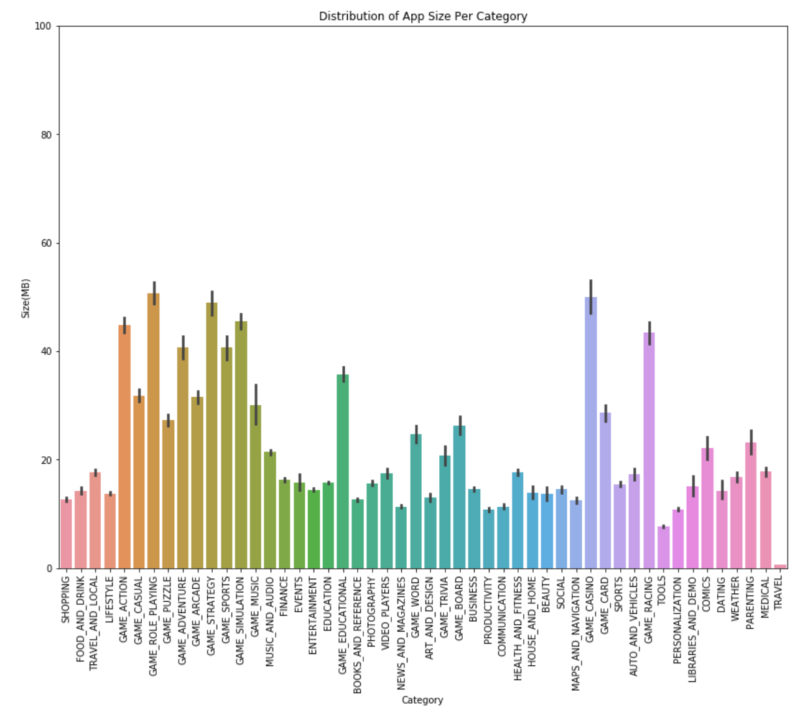
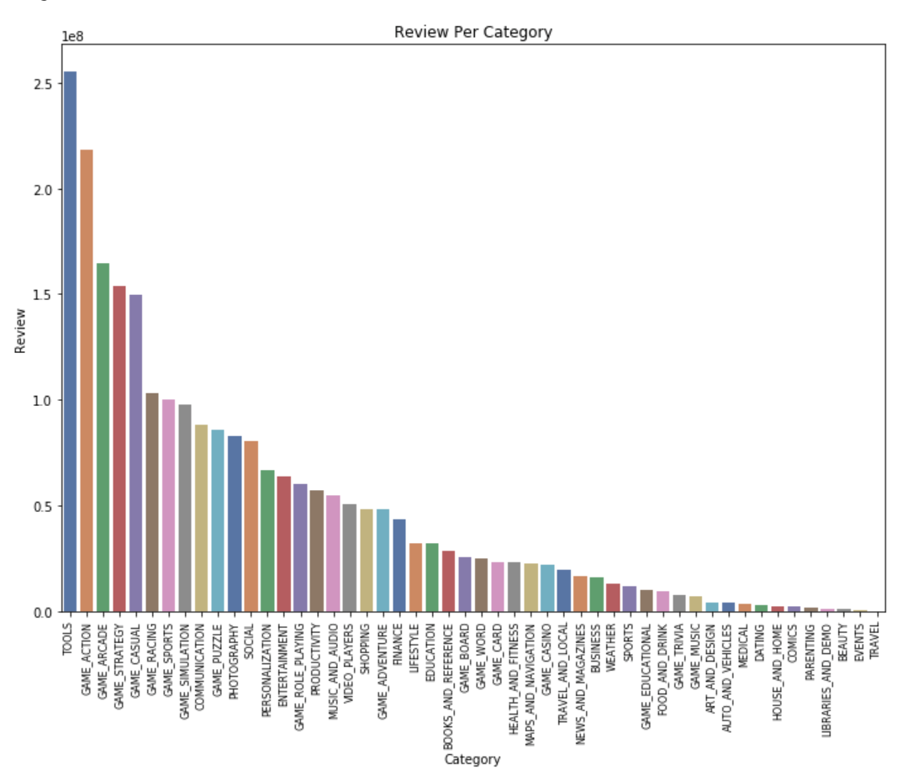

# Google-Playstore-Joshua-Ver1
Analyse and Visualise Google Play Store 
Google Playstore Joshua Ver1 is a project where I analyze and visualize data taken from the Indonesian Google Playstore. 

  
From the results of data retrieval from Google Playstore, the Python programming language is used to interpret the collected data. As in the picture, it shows that the population of 267,052 application data was taken. It shows that the distribution of applications listed on the Google Playstore is separated using the category in which the application is categorized. It shows that the category with the highest number of calculated applications is the Education category application with more than 20 000 registered applications. Furthermore, it shows from the graph that the second largest number is Tools (Tools), then there are Books and Reference (Books & Reference) and Entertainment (Entertainment). When viewed from the game category's total population, it is separated according to the sub-category of the game. 
  
It shows that the majority of applications with the largest size on the Google Playstore are in the Casino Games category, but that is also followed by game types such as Role Playing Games and so on. This data shows that the majority of game applications have a larger average application size than other categories. Also, the graph shows that the travel category application has the smallest application size. These are illustrations that the majority of applications categorized as travel have low magnitudes. 
  
From the graph above, the category that has the most number of reviews is Tools. Of the Google Playstore population, the Tools category has the second-lowest number of applications after travel. This illustration shows high participation in this category from users to provide reviews of the applications used, especially in the Tools category. 
#These are a small part of the analysis, and you can look further if you open a notebook in this repository.
