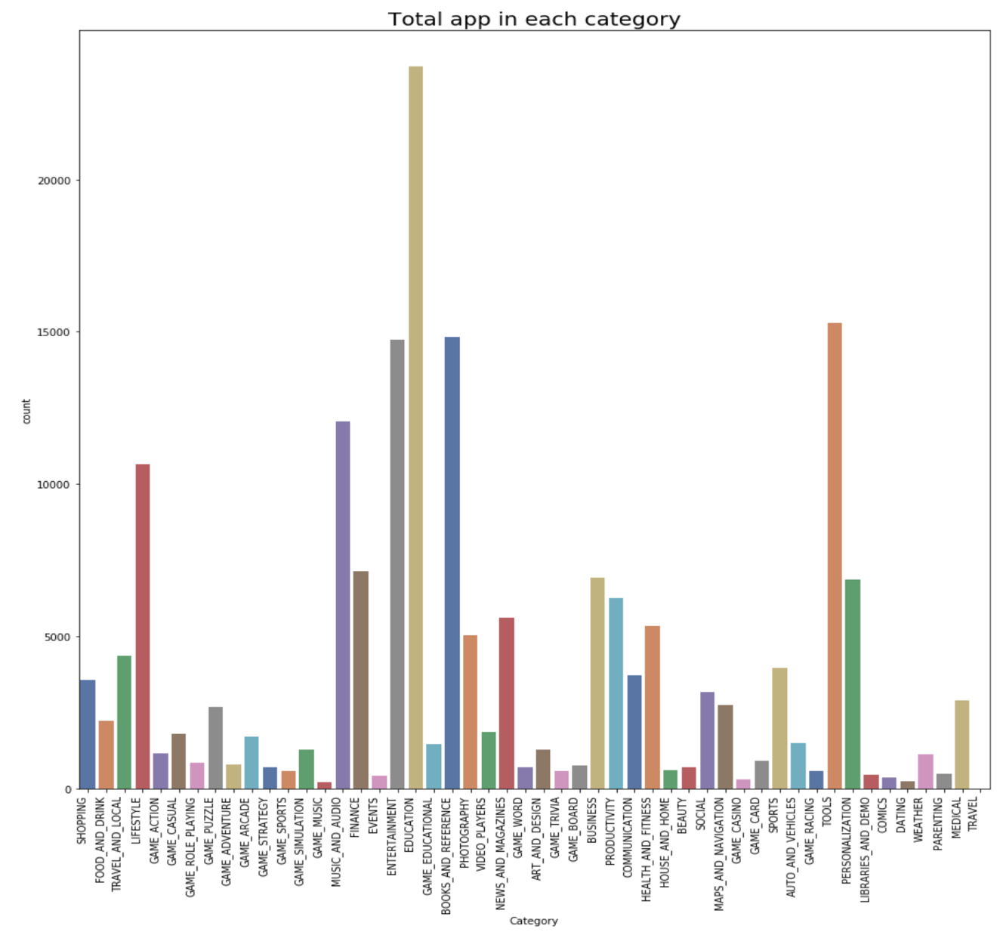

# Google-Playstore-Joshua-Ver1
Analyse and Visualise Google Play Store 
Google Playstore Joshua Ver1 is a project where I analyze and visualize data taken from the Indonesian Google Playstore. 

From the results of data retrieval from Google Playstore, the Python programming language is used to interpret the collected data. As in the picture, it shows that the population of 267,052 application data was taken. It shows that the distribution of applications listed on the Google Playstore is separated using the category in which the application is categorized. It shows that the category with the highest number of calculated applications is the Education category application with more than 20 000 registered applications. Furthermore, it shows from the graph that the second largest number is Tools (Tools), then there are Books and Reference (Books & Reference) and Entertainment (Entertainment). When viewed from the game category's total population, it is separated according to the sub-category of the game.
